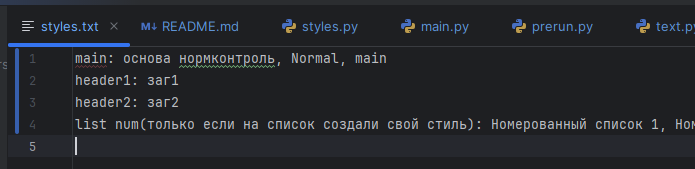

# docx_autostyle
Предобработка:

Задать роль стилей в вашем файле можно в input/config.txt 
Если использованный стиль не указан в файле и его автоматически не определил как стиль списка, подписи к рисунку или заголовка источников, абзац с этим стилем не будет изменён и название стиля будет выведено в терминал.
Для работы нужна `python-docx`

Теперь можно запустить `main.py` c указанием названия файла Пример: `python main.py c.docx`. Он создаст 2 файла в output: `work_c.docx` с исправленным нормоконтролем и `diffs.docx`, в котором показаны изменения:
Жёлтое подчёркивание, если изменён стиль и красный шрифт, если изменён текст
## Что пока не работает

- Таблицы и картинки не изменяются
- Текст кода
- Стили захардкожены

## Как определяется стиль параграфа
- Основной и заголовки первого и второго уровня задаются в файле
- Если к абзацу применён список, то он становится списком своего типа
- Если в тексте есть `рисунок` и `(рисунок ` отсутствует, он становится стилем рисунка
- Если в тексте есть слово `часть` и в нём не более 3 слов, он становится стилем заголовка источников (ТЕОРЕТИЧЕСКАЯ ЧАСТЬ, ПРАКТИЧЕСКАЯ ЧАСТЬ)

## Изменения текста
- Во всех параграфах заменяются двойные пробелы, неразрывные пробелы, дефисы, окружённые пробелами, на тире неправильные кавычки, добавляются пробелы там, где это нужно
- В списках меняется регистр первой буквы и `.`, `;` в конце
- рисунок заменяется на Рисунок, минус заменяется на тире 
